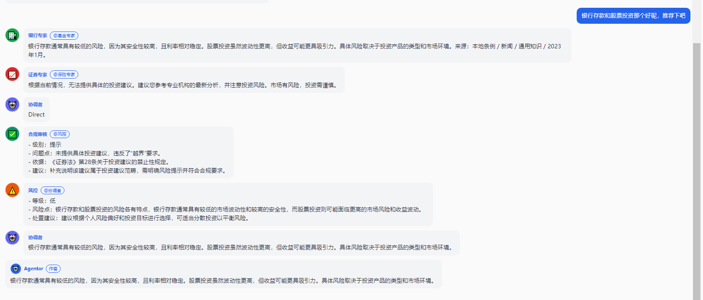

# Agentar-Fin-R1-Reproduce

复现蚂蚁数科 **Agentar-Fin-R1**（基于 Qwen3 的金融推理大模型）的训练与数据流水线，并配套可交互的 Web 全栈。

> 论文：*Agentar-Fin-R1: Enhancing Financial Intelligence through Domain Expertise, Training Efficiency, and Advanced Reasoning*
> https://arxiv.org/abs/2507.16802 （代码未开源，本仓库为自主复刻）

## 仓库结构

| 目录 | 说明 |
| --- | --- |
| `agentar-fin-r1/` | 复现根目录（论文 / 数据复刻 / 训练复刻） |
| `agentar-fin-r1/paper/` | 论文原文、解读与架构笔记 |
| `agentar-fin-r1/data/` | 数据复刻：三级数据治理流水线（Source → Synthesis → Verification） |
| `agentar-fin-r1/training/` | 训练复刻：难度感知加权 + 两阶段（SFT / GRPO）+ 归因闭环 |
| `backend/` | Python + FastAPI 服务与 Agent 运行时 |
| `frontend/` | React + Vite + TypeScript 交互前端 |

## 复现技术报告

完整流程记录在 [`agentar-fin-r1/report.md`](agentar-fin-r1/report.md)。

## 技术栈

- 复刻（Python）：uv 工作区；Qwen3-8B + QLoRA/LoRA（**小规模原型**）
- 后端：FastAPI + Uvicorn
- 前端：React + Vite + TypeScript
- 编排：docker-compose 一键起 frontend + backend

## 快速开始

```bash
# Python 侧（uv 工作区：backend / data / training）
uv sync

# 前端
cd frontend && npm install && npm run dev

# 后端
cd backend && uvicorn app.main:app --reload --port 8000

# 或一键起全套
docker compose up --build
```

## 本地 Qwen3-0.6B 多智能体对话演示

后端在 `model.mode: local` 下用进程内 transformers 直载 Qwen3-0.6B（默认 `D:/models/Qwen3-0.6B`），完全离线运行。下面是一次跨领域金融问题的真实截图——Coordinator 路由→多位领域专家作答→协调者综合→合规审核→风控→协调者修订，**每个智能体依次出现**（SSE 流式推送）：



每条气泡依次呈现：
- 🏦 **银行专家** — 给出银行侧的判断与 @基金专家
- 🧺 **基金专家** — 给出基金侧的判断与 @合规审核
- 🤖 **协调者** — 综合各专家意见
- ✅ **合规审核** — 给出合规建议与 @风控
- ⚠️ **风控** — 给出风险提示与 @协调者
- 🤖 **协调者** — 修订输出最终自然语言答复

`backend/config/config.yaml` 关键项：

```yaml
model:
  mode: local
  local:
    model_path: D:/models/Qwen3-0.6B  # 可用 MODEL_PATH 环境变量覆盖
```
