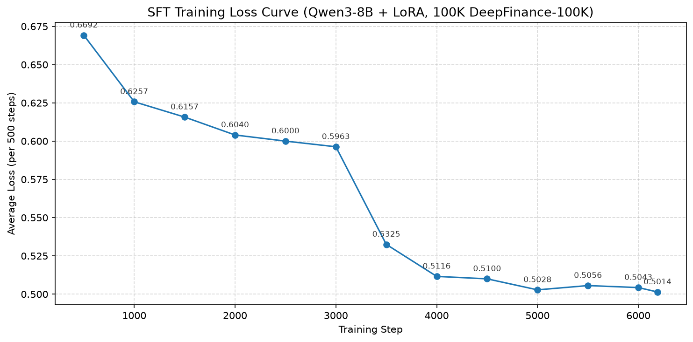

# Agentar-Fin-R1 — verl 训练（SFT + DAPO + OPD）

本目录是 **verl 0.8.0** 版的三阶段训练实现。原 ms-swift 版已删除，仅保留 verl。
决策背景见根 `report.md`：ms-swift 在 RL 阶段 rollout 用 `transformers.generate`、
reward 同步阻塞，verl 用 vLLM rollout + Ray 式流水线，对本项目「代差级」提速。

三阶段：
- **Stage 1 SFT**：金融知识注入（Qwen3-8B + LoRA r=64）
- **Stage 2 DAPO**：难题攻坚（在 SFT merge 后模型上做 RL，DAPO 解耦 KL 至 reward）
- **Stage 3 OPD**：蒸馏压缩（教师 Qwen3-8B → 学生 Qwen3-0.6B，On-Policy Distillation）

## 目录结构

```
training/
├── README.md
├── merge_lora.py                 # 合并 SFT LoRA → 完整 checkpoint
├── sft/
│   ├── train_sft.py              # Stage 1 超参持有 + 训练启动器
│   ├── train_sft.sh              # Stage 1 两阶段壳（预处理 → 训练）
│   ├── prepare_sft_data.py       # 原始对话 JSON/JSONL → verl parquet
│   ├── sft_loss_curve.png        # SFT 训练 loss 曲线
│   └── pyproject.toml            # 环境依赖
├── dapo/
│   ├── train_dapo.sh             # Stage 2 两阶段壳（预处理 → DAPO 训练）
│   ├── prepare_dapo_data.py       # 原始对话 JSON/JSONL → verl DAPO parquet
│   ├── fin_judge_reward.py        # 奖励函数：格式闸门 → RLAIF rubric 打分
│   └── plot_logs.py               # 训练日志离线绘图
└── opd/
    ├── train_opd.sh               # Stage 3 两阶段壳（预处理 → OPD 蒸馏训练）
    ├── prepare_opd_data.py        # 原始对话 JSON/JSONL → verl parquet（仅 prompt）
    └── plot_logs.py               # 训练日志离线绘图（蒸馏指标）
```

## 运行顺序

```bash
# 1) Stage 1 SFT（一键：原始数据 → 预处理 → 训练）
RAW_DATA=./data/raw/train.json bash training/sft/train_sft.sh
# 产物 → ./training/sft/outputs

# 2) 合并 SFT LoRA
python training/merge_lora.py \
    --base ./Qwen3-8B \
    --adapter ./training/sft/outputs \
    --output ./training/sft/merged

# 3) 配置裁判 API（DAPO 的 RLAIF 裁判需要）
#    export JUDGE_API_KEY=<your key>

# 4) Stage 2 DAPO（一键：原始数据 → 预处理 → 训练）
RAW_DATA=./data/raw/train.json bash training/dapo/train_dapo.sh
# 产物 → ./training/dapo/outputs

# 5) Stage 3 OPD 蒸馏（教师 Qwen3-8B → 学生 Qwen3-0.6B，纯蒸馏无需裁判）
RAW_DATA=./data/raw/train.json bash training/opd/train_opd.sh
# 产物 → ./training/opd/outputs
```

## 训练曲线绘图

各阶段训练完成后，用对应目录的 `plot_logs.py` 离线解析 verl 日志出图：

```bash
python training/dapo/plot_logs.py   # 默认扫 ./training/dapo/outputs/ → training_curves.png
python training/opd/plot_logs.py    # 默认扫 ./training/opd/outputs/ → training_curves.png
```

依赖 matplotlib（已加入 `sft/pyproject.toml` 的 observability 可选组）。

## SFT 训练结果（Qwen3-8B + LoRA，DeepFinance-100K）

训练配置：8×A800, batch=16, lr=1e-4, warmup 3%, cosine, 2 epochs



- 最终 loss: 0.5014，相比起始 0.6692 下降约 25%
- 3000~3500 步有一次陡降，随后稳定收敛在 0.50~0.51

## reward 实现（dapo/fin_judge_reward.py）

格式闸门只检查 `<think>…</think>` 存在。通过后由外部 DeepSeek V4 Flash 按 4 维 rubric 打分：

| 维度 | 权重 | 对标内容 |
|------|------|----------|
| correctness | 0.40 | 答案 vs gold_output |
| reasoning | 0.30 | 推理链 vs gold_thinking |
| compliance_risk | 0.15 | 风险/合规意识 |
| clarity_format | 0.15 | 表达结构 |

推理和答案分开对标：裁判先看 thinking 打 reasoning 分，再看 output 打其余三维度分。

> Stage 3 OPD 为纯蒸馏（`use_task_rewards=False`），教师给 token 级 logprob 监督，不走上述裁判。

## 注意事项

1. **显存**：8×A800 80G，SFT 每卡 ~30-40GB，DAPO（actor+vLLM+ref offload）~60GB。
2. **OPD 资源池**：教师模型走独立 Ray 资源池，需拆卡（如学生 4 卡 + 教师 4 卡）。见 `opd/train_opd.sh` 头部注释。
3. **裁判**：需导出 `JUDGE_API_KEY`，走 DeepSeek API。串行调用，吞吐受 API RPS 限制。
4. **dtype**：统一 bf16，A800 原生支持。
5. **merge**：`merge_lora.py` 假设 verl SFT 输出为 peft 兼容格式。若非 peft 格式，跳过 merge，SFT 全参 + DAPO 自带 LoRA。
6. **蒸馏 tokenizer 一致性**：OPD 要求教师与学生同 tokenizer/vocab（同为 Qwen3 家族，满足）。
